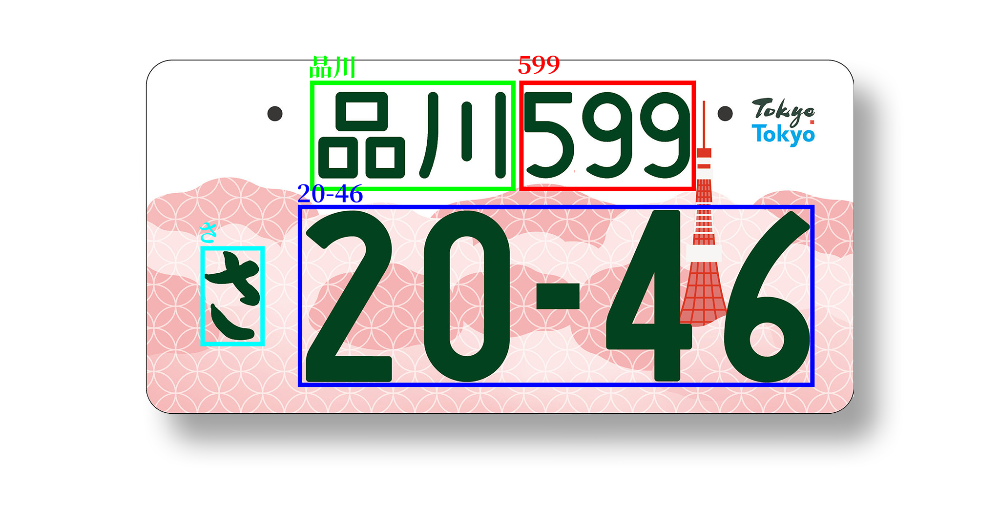

# CNPJP 自動車登録番号標認識システム
**Car Number Plate JP**

Rapidity, Universality And Easily.
A lightweight ALPRs(Automated License Plate Readers) engine to read Japanese car number plates, with Docker support.

速度性、汎用性、そして使いやすさを兼ね備えた自動車牌読取りシステム(ALPRs)。
Docker技術を使い、日本の車のナンバープレートを簡単に読み取れます。
---

2023/11/07

現在のプロジェクトでは、アメリカや中国にあるデータを使ってテストしております。

しかし、日本のナンバープレートの仕様と違いので、精度はいまいちです。なので、日本のナンバープレートのデータセットを作ってトレーニングすることを検討しております。

この半ヶ月間、開発者が自分で運転して、たくさん路面の写真を撮りました。

いよいよ整理して、データセットに作っております。
これからもよろしくお願いします。

---

**How to use | 使い方:**

[CNPJP WIKI](https://github.com/KouShoken/CNPJP/wiki/%E3%83%9B%E3%83%BC%E3%83%A0)

**Discord Server:**

[https://discord.gg/2rKg6ajSaQ](https://discord.gg/2rKg6ajSaQ)

---

About ALPRs:
https://www.eff.org/ja/pages/automated-license-plate-readers-alpr

Archive (上記のアーカイブ):
https://web.archive.org/web/20230921093947/https://www.eff.org/ja/pages/automated-license-plate-readers-alpr

## About This Document
For the sake of uniformity, except for the necessity parts of this document, 
most of the content will be written in Japanese.

統一性のために、このドキュメントは必要が部分を除いて、基本的に日本語で書かれています。
予めご了承ください。

# The workflow about CNPJP

First, It's based on Docker than you can deploy CNPJP on every Docker Support System.
Then you can use HTTP/HTTPs to request the vehicle information on a picture,
the response will contain vehicle image, color, license plate picture, license plate OCR information, etc.

## How to use

We provide an API interface.

APIでサービスを提供しています。

Document(Postman)：　[https://documenter.getpostman.com/view/27989161/2s9YJXaR2s](https://documenter.getpostman.com/view/27989161/2s9YJXaR2s)

## Supported Number Plates
**支援するナンバープレート**

All guidance related to number plates in this project is based on information provided by
the Automobile Inspection & Registration Information Association (AIRIA),
so for inquiries not related to recognition technology (especially about number plates),
it would be good to refer to the AIRIA website.

まず、本プロジェクトのナンバープレートに関する指導は、すべて自動車検査登録情報協会が提供した情報に基づいて行うのため、
認識技術以外の疑問（特にナンバープレート）については、[自検協HP](https://www.airia.or.jp/)
を参考すれば良いと思います。

（自検協HPにより）

[一般社団法人 全国自動車標板協議会](https://www.n-p.or.jp/) 

# Open Source Licenses
* [bootstrap](https://getbootstrap.com/)
